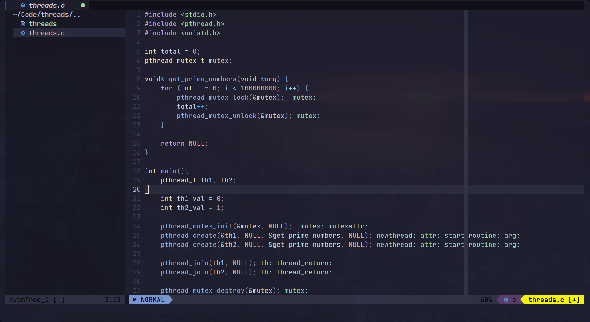
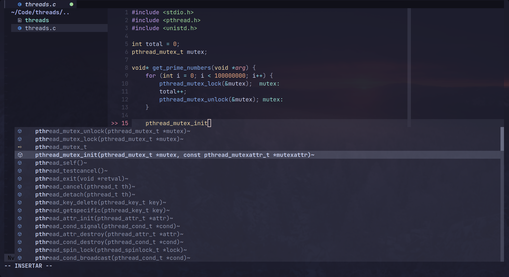

# Neovim Setup

## Pics

- Setup
  

- Autocomplete
  

## Installation

```sh
# Install Vim plug (plugin manager)
sh -c 'curl -fLo "${XDG_DATA_HOME:-$HOME/.local/share}"/nvim/site/autoload/plug.vim --create-dirs \ https://raw.githubusercontent.com/junegunn/vim-plug/master/plug.vim'

#Init nvim
nvim .

#Exec this command
:PlugInstall

#Restart neovim 🚀
```

## Install Plugins with coc
If you want to install plugins as autocomplete or lsp, you have to use coc.

The coc plugins list is:
[Coc extensions list](https://github.com/neoclide/coc.nvim/wiki/Using-coc-extensions#implemented-coc-extensions)


#### **Made by Nimeavles with ❤️**
